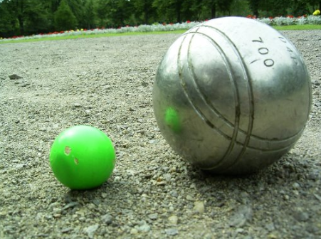
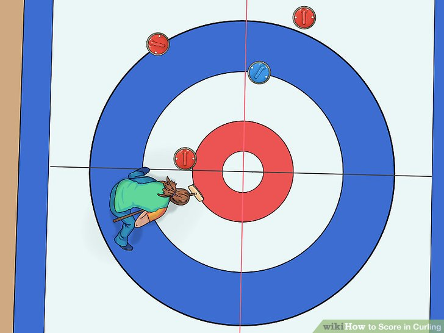
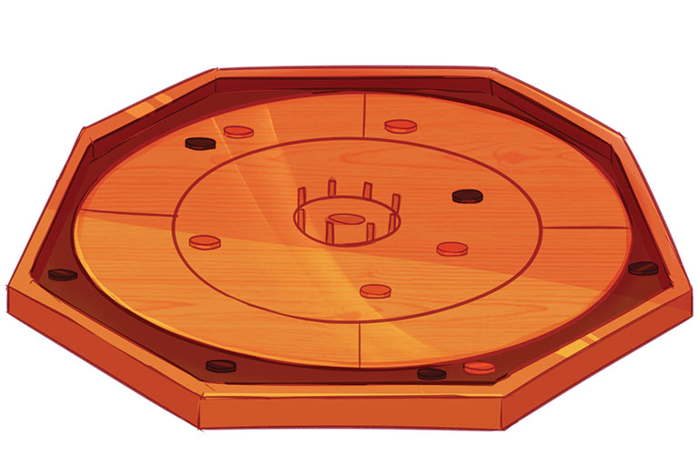
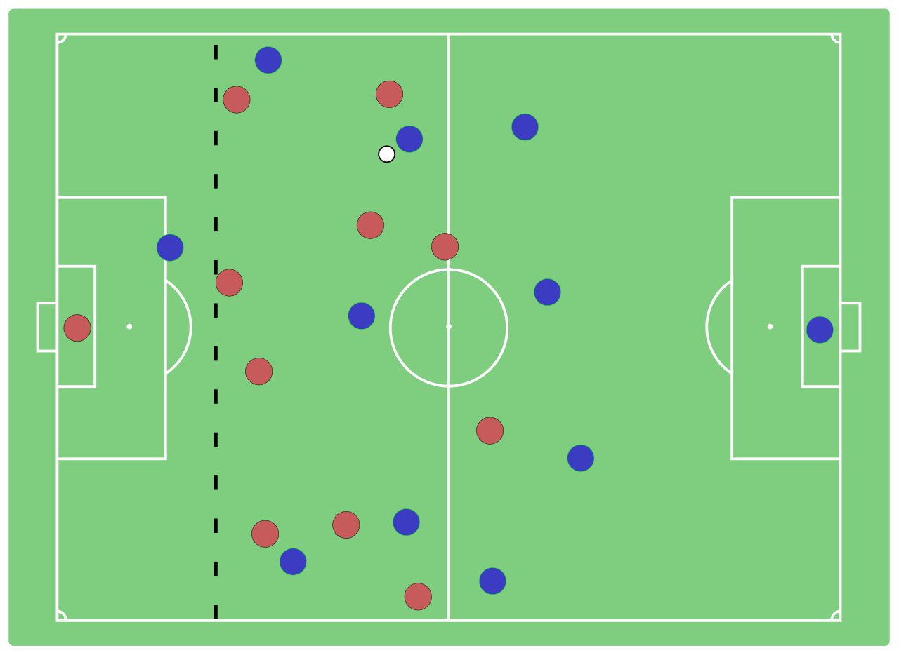
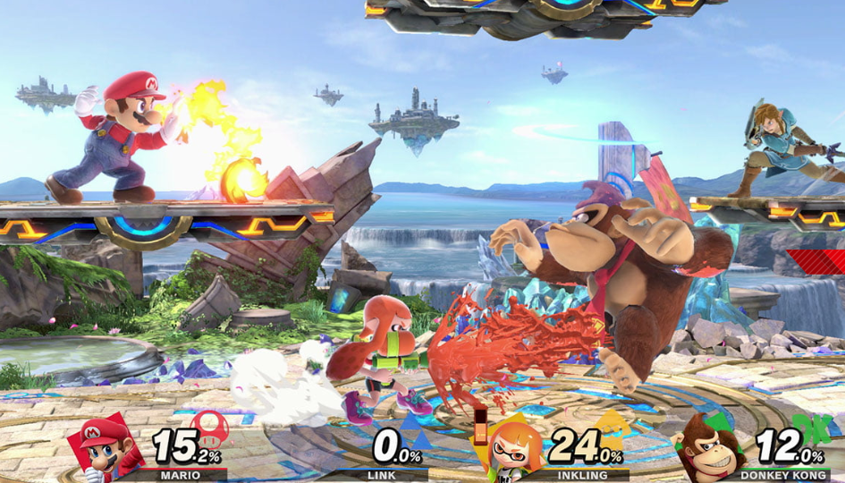
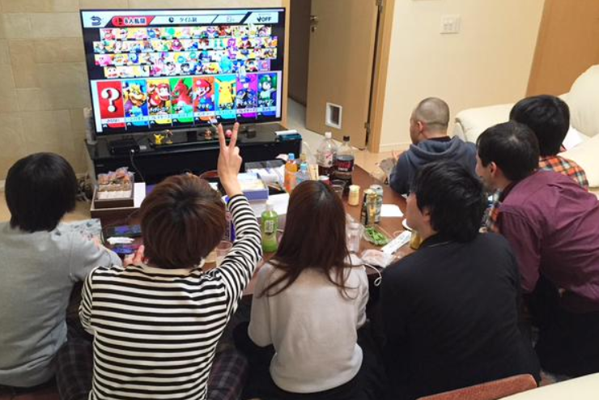

class: middle

# Welcome!

.hi[CART 215 / Fall 2019 / Week 01 / Enric Granzotto Llagostera]

---
class: middle

## Summary

1. Introductions
2. Course overview
3. Play & discuss
4. Game design exercise
5. Lecture: A vocabulary for game design

---
class: middle

# Introductions

---

## Enric Granzotto Llagostera

- He / him.
- From São Paulo, Brazil.
- Background in programming, media studies, film making / web, and game design.
- MSc in Games from IT University Copenhagen.
- Game designer work in Brazil, as well as instructor on game dev courses.
- PhD student at Concordia University.

.right[.no_border[]]

---

## Alternative controls (alt ctrls)

- Invitations for **playfulness**.
- Learn to play all over again, (potentially) lower barriers of entry.
- **Unexpected materiality** as basis for play.
- Reminders that we are **embodied players**.

---
class: middle center

[gambiabo](https://enricllagostera.github.io/gambi_abo/)

---

## _Political_ alt ctrls

- The need to **problematize innovative game design** discourses.
- Brecht & **alienation** to point to systemic forces.
- Boal & forum theatre: play & situated dialogue.
- Relationship with **craft, industry and DIY practices**.
- Alt ctrls help to re-situate and transform play, pointing to different systemic issues and new practices.

---
class: middle center

<iframe title="vimeo-player" src="https://player.vimeo.com/video/303835628" width="720" height="480" frameborder="0" allowfullscreen></iframe>

[Cook Your Way](https://enric.llagostera.com.br/cookyourway/)

---

# What about .hi[you]?

Let's start to get to know each other and have a sense of common interests and ideas.

--

- Name, pronouns.
- One or two games you enjoy.
- Why game design?

---
class: middle

# Course overview

---

## Course website & Moodle

- **Website** (_everything, except uploads and hand-ins_)
  - <https://github.com/enricllagostera/cart215-2019>.
- **Moodle** (_hand-ins_)
  - <https://moodle.concordia.ca/moodle/course/view.php?id=119891> or via MyConcordia.

---
class: middle

## [Course .hi[outline]](https://github.com/enricllagostera/cart215-2019/blob/master/course-information/course-outline.md)

## [Course .hi[schedule]](https://github.com/enricllagostera/cart215-2019/blob/master/course-information/course-schedule.md)

---
class: middle

# Let's .hi[play]!

---

class: middle

# A vocabulary for game design

---

## What was changed in the game?

---

class: middle

## .hi[basic elements]: actions, goals, rules, objects, playspace, players

---

## Actions

- The activities players perform while playing. Some relate directly to a game’s goals, others don’t.
- Rules that **let players do something**.
- Actions allow players to communicate back to the game.
- Actions usually have **physical layers**.
- Actions **develop relationships** to other elements.

---
class: middle center

[René Higuita](https://en.wikipedia.org/wiki/Ren%C3%A9_Higuita)'s scorpion kick

---

## Goals

- The outcomes players try to achieve.
- They do not need to be **quantifiable** and can be purely **experiential**.

---
class: middle center

--

--

---

## Rules

- The instructions for how the game works.
- They also **define relationships and behaviors** of the different elements of a game.

---
class: middle center

.no_border[]

The offside rule in association football (soccer).

---

## Objects

- The things used to play a game.
- They can be both very concrete or abstract, tangible or not.
- Objects are usually key to think about a game’s **context**.

---
class: middle center

--

--

---

## Playspace

- The space in which the game takes place, as defined by the rules.
- It might be a specialized, bounded area, or something much more fluid.

---
class: middle center

---
class: middle center

--

---

## Players

- The operators of the game, and the relationships between them.

---
class: middle

# .hi[Wrap-up!]

--

- Remember the readings!
- Exercise: reflecting on today's game modding.
  - You will receive an email notification with the instructions later today.
  - Check the website regularly for updates.

---

## References

Macklin, Colleen, and John Sharp. 2016. Games, Design and Play: A Detailed Approach to Iterative Game Design. First edition. Boston, MA ; San Francisco, CA: Addison-Wesley.
