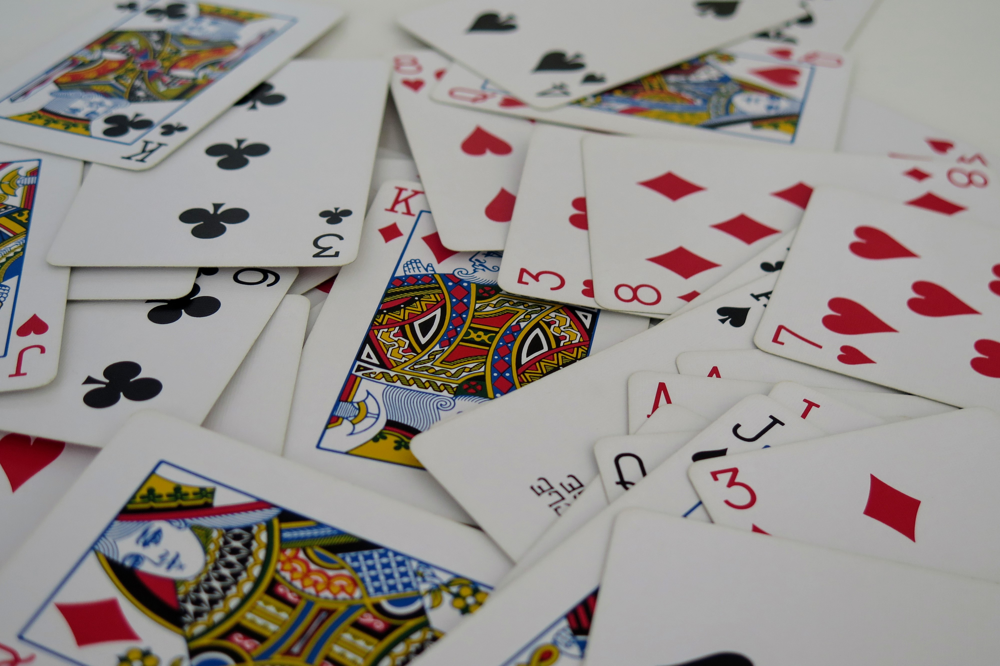
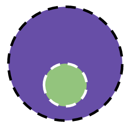
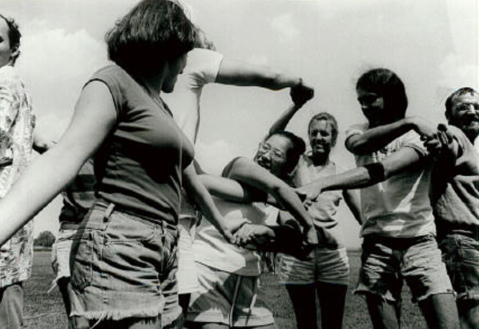
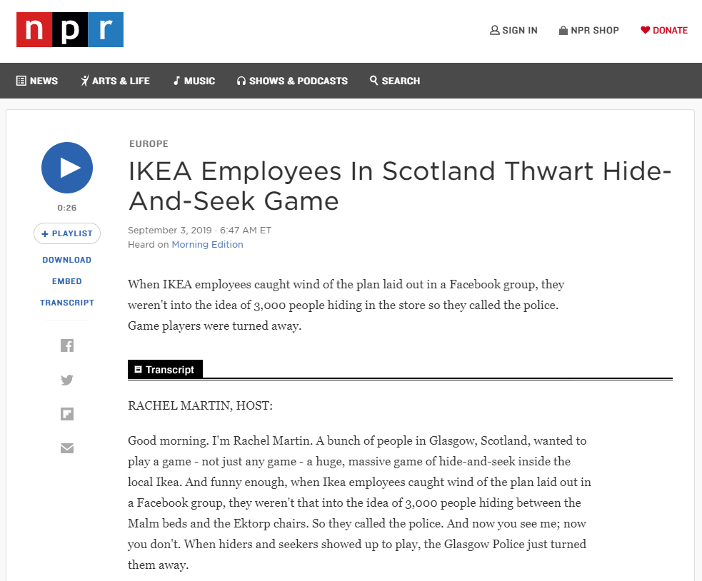
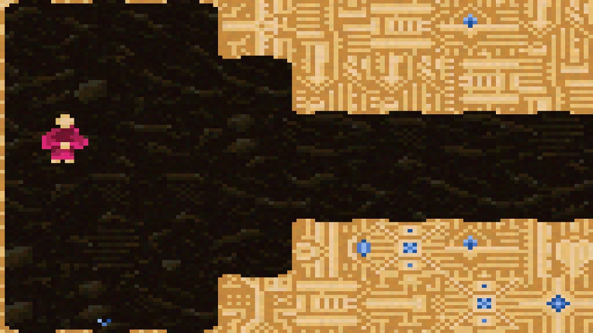
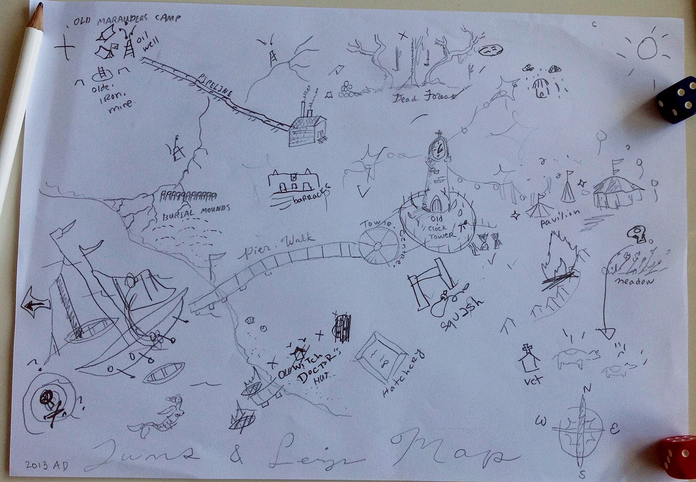
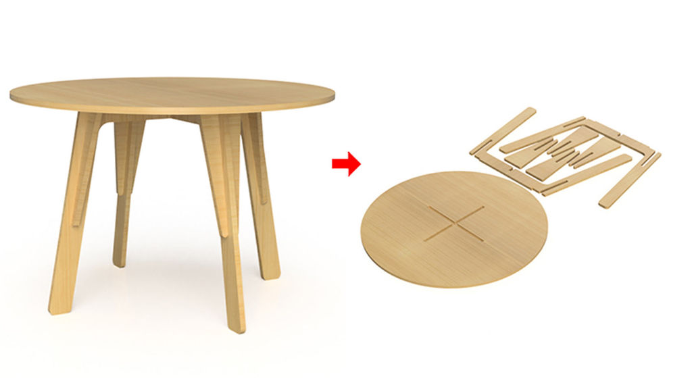

class: middle

# Play is The Thing

.hi[CART 215 / Fall 2019 / Week 02 / Enric Granzotto Llagostera]

---

class: middle

## Summary

1. Game rec(s)!
2. Wrap-up work on card game exercise
3. Game design elements recap
4. Lecture: Play & Games
5. Let's play: Who took the apple?
---

### Game rec 1: .hi[A Short Hike], by adam robinson-yu

<iframe width="640" height="360" src="https://www.youtube.com/embed/l4bWwobx_LQ" frameborder="0" allow="accelerometer; autoplay; encrypted-media; gyroscope; picture-in-picture" allowfullscreen></iframe>

<https://ashorthike.com>

---

### Game rec 2: .hi[Bounden], by Game Oven

<iframe title="vimeo-player" src="https://player.vimeo.com/video/95726417" width="640" height="360" frameborder="0" allowfullscreen></iframe>

<https://playbounden.com/>

---

### Notes on exercise 01

- Many reflections on balancing / pacing.
- Difference between description / reflection.
- Some cool interesting ideas/observations:
  - New characters (players).
  - Physical building (playspace).
  - Sitting positions (playspace).
  - Bluffing, revealing (actions).
  - Comments about specific and concrete player reactions (playtesting).
- Pick an element and bend it more intensely.
- Focus on prose to summarize.
- Respect the 300 words constraint / submission process / deadline.

---
class: middle

## Recap: game design elements

--
### .hi[actions, goals, rules, objects, playspace, players]

---
class: middle

## Analysis: 54-card deck

---
class: middle

### objects
--

### actions
--

### goals
--

### rules
--

### playspace
--

### players

---
class: middle

# On .hi[play]

---

class: middle center

---

## On play

Play is not tied to an _object_ or _activity_, but "brought by people to the complex interrelations with and between things that form daily life" (Sicart, p. 2)

---

## On games

Games as a culturally and economic dominant form of play, but not its center. Play inhabits a messy and entangled **ecology of play**.

Sicart's theory as a reaction to **instrumental / mechanized play**, embodied in current dominant forms.

---
class: middle

## .hi[**What can we play?**]

---
class: middle

## .hi[**What is this instrumental / mechanized play?**]

---

class: middle

### Our success in the search for the well-played game can only be measured in terms of how well we have been able to play together. (DeKoven, p.5)

---

## A well-played game

Think of an experience you had of a "well-played game".

--
- **What** were you playing (at/with)?

--
- With **whom** (or alone)?

--
- What was the **context** of that play session?

--
- What was **memorable** about it?

---

An example from DeKoven’s _New Games Book_.

---

## DeKoven’s well-played game

- Play is **negotiated** and fundamentally dynamic.
- Play experience is dependent on **expectations**.
- Usually, winning is the only shared premise, which leads to **separation**. This is _antithetical_ to the well-played game.
- The well-played game as **physical and mental well-being** based on players' will, safety, trust.
- Play experience refers to a **personal and social history of play**.

---

## DeKoven’s guidelines

- Constant negotiation of the **intent** to play well together.
- Willingness (and therefore **consent**) to take that effort.
- The need to **feel safe** (with the game and with each other) when playing.
- _Familiarity_ and _repertoire_ as basis for **trust**.
- **Conventions** _extend_ the basis for familiarity.

_Example: the [Ars Amandi and Ars Marte](http://www.ars-amandi.se/resources/the-ars-amandi-method/) methods in  Nordic LARP._

---

class: middle

### To play is to be in the world. Playing is a form of understanding what surrounds us and who we are, and a way of engaging with others. .hi[Play is a mode of being human.] (Sicart, p. 1)

---

## Play is _contextual_

- It is bound by rules, spaces and communities. Its context is a "network of things, people, and places needed for play to take place" (Sicart, p. 7).

--
- .hi[How can we tell if a context is a play context?]

---

## Play can be _designed_

- Play is "mediated by things created to facilitate the emergence of play" (Sicart,p. 7).
- Rules are "formal instruments for the creation and sharing of contexts of play" (Sicart,p. 8). And computers are great for this.
- Rules are not the only element of a context of play. Rules are dynamic, and negotiated, enforced by a variety of actors and things.

---

## Play is _carnivalesque_

- Play as tension between creation / destruction, order / disorder.

--
- .hi[How do we play between excessive order and compulsive destruction?]

---

### [La Tomatina](https://en.wikipedia.org/wiki/La_Tomatina)

---

### La Tomatina

- Do not throw bottles or hard objects
- Do not tear or throw tee-shirts
- Squash tomatoes before throwing them to avoid hurting others
- Keep a safe distance from trucks
- Stop throwing tomatoes after the second starter pistol shot
- Follow the directions of security staff

---

## Play is _appropriative_

- It takes over contexts while not being totally predetermined by them.
- The objects used are appropriated by play so it can come into existence.

---

### An ola

<iframe width="640" height="360" src="https://www.youtube.com/embed/9HRUGoMm_zw" frameborder="0" allow="accelerometer; autoplay; encrypted-media; gyroscope; picture-in-picture" allowfullscreen></iframe>

---

## Play is _disruptive_

- It breaks the status quo, and so it reveals much about that which it breaks.
- We can lose ourselves into play, and be damaged by its unbalances, tensions and destructive elements.

---

### IKEA hide and seek

---

## Play is _autotelic_

- It has its own goals, purposes and limits. These are not rigid, they can evolve and change during play.
- This is an important element when discussing instrumental / mechanized play.

---

### Vesper.5, by Michael Brough

[Link to the game.](http://mightyvision.blogspot.com/2012/08/vesper5.html)

---

## Play is _creative_

- It is a creative way of expression, both shared and personal.
- Play supports communities and develops shared histories and understandings.

---

### CS:GO Surfing

<iframe width="640" height="360" src="https://www.youtube.com/embed/8LpotSijbqs" frameborder="0" allow="accelerometer; autoplay; encrypted-media; gyroscope; picture-in-picture" allowfullscreen></iframe>

--

Appropriation of the physics engine, with its bugs and glitches.

---

### [A Quiet Year, by Avery Alder](https://buriedwithoutceremony.com/the-quiet-year)

[Link to the game.](https://buriedwithoutceremony.com/the-quiet-year)

---

## Play is _personal_

- It is entangled with the web and trajectory of each person's life.
- It depends and builds upon memories, views, morals and its effects are unique.

.hi["We play to be" (Sicart, p. 18).]

---
class: center

### .hi[Play] is...

--
### contextual

--
### carnivalesque

--
### appropriative

--
### disruptive

--
### autotelic

--
### creative

--
### personal

---
class: middle

## Let's play: .hi[Who took the apple?]

by the Copenhagen Game Collective.

---

### Who took the apple? - Rules 1/3

**Setup**

- Put away all cards marked with a *
- Deal the rest of the cards to the players. Each player receives a set of four cards in the same color.
- Place an apple under a bucket. All players form a circle around the bucket.

---

### Who took the apple? - Rules 2/3

**Play**

- Player one and three are a team competing against player two and four. The goal of the game is to be the team who took the apple.
- Player four plays a card face up on the ground. Remember this game is played backwards, first card played will be last action happening!
- Now going counter clockwise (backwards in time) each player plays a card face up on the top of the stack of played cards. The player states loud and clear “Before that, I…” followed by the action printed on the card.

---

### Who took the apple? - Rules 3/3

**Ending the game**

- Once all cards are played each player takes a beer and holds on to it. Go through the deck from top to bottom and carry out the actions printed on the cards. If an action is identified as impossible to carry out, everybody cries “Paradox!” and that card will be ignored to restore space/ time logic.
- The game ends the moment a player takes the apple.

_Rules from: <http://www.copenhagengamecollective.org/projects/who-took-the-apple/>_

---
class: middle

## Object analysis: flatpack furniture

---
class: middle

### Results?

--
- What processes exist around them?

--
- What are their different materials and parts?

--
- In what contexts these objects circulate?

---

### Home Improvisation, by [The Stork Burnt Down](http://www.thestorkburntdown.com/)

<iframe width="640" height="360" src="https://www.youtube.com/embed/BWurQYLH0YU" frameborder="0" allow="accelerometer; autoplay; encrypted-media; gyroscope; picture-in-picture" allowfullscreen></iframe>

<http://www.homeimprovisation.com/>

---
class: middle

# .hi[Wrap-up!]

--

- Remember the readings for next week.
- Notice the world around you: exercise 2 will be up tomorrow!

---
## References

DeKoven, B. (2013). Searching for the Well-Played Game & Guidelines. In The well-played game: a player’s philosophy (pp. 1–9). Cambridge, Massachusetts: The MIT Press.

Sicart, M. (2014). Play is. In Play matters (pp. 1–18). Cambridge, Massachusetts: The MIT Press.
