class: middle

# Game Design Tools

.hi[CART 215 / Fall 2019 / Week 03 / Enric Granzotto Llagostera]

---

class: middle

## Summary

1. Game rec!
2. Feedback on exercise 2
3. Lecture: Game Design Tools
4. _Break_
5. Project 1
   1. Group division
   2. Ideation session
   3. Studio time

---

### Game rec: .hi[Bastion], by Supergiant

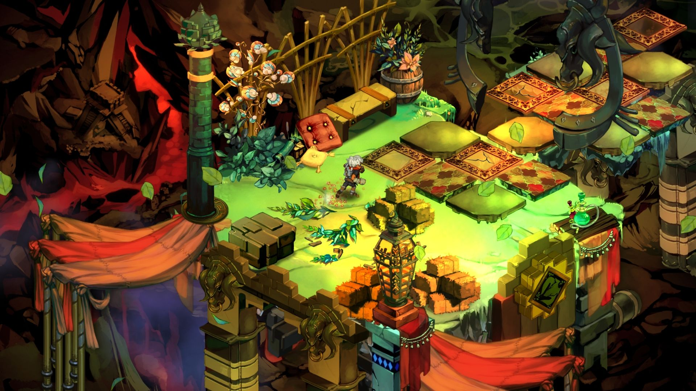

<https://www.supergiantgames.com/games/bastion/>

---

### Feedback from .hi[exercise 2]

- Use of **appropriative / disruptive play**: quickly the discussion moves into ethics and social norms.
- Very interesting uses of **databases / information tracking** as forms of collective play.
- **Gamification**: how does earning points relate to the instrumental play?
- Games with different **durations and starting / end points**.
- **Public transportation**: why is is such a recurrent theme?
- Mix of **cooperative and competitive** games: how does that change with the number of players?
- **"Drafts"**: 4 students did not submit the exercise. This is the .hi[last time] I'll accept those.

---
class: middle

## What is game design?

---

### From .hi[practitioners]

> Game design is the process of creating the _content_ and the _rules_ of a game (Brathwaite, 2009).

> As game creators, we want to design the _rules_ that will make for the strongest experience. We want to design rules that have relationships to each other. We want to design rules that have _the opportunity to develop as the game goes on_ and avoid rules that we won’t be able to develop. (Anthropy & Clark, 2014)

---

### From .hi[practitioners]

> Game design is the process of conceiving of and creating the way a game _works_, including the actions, goals, rules, objects, playspace, and number of players. (Macklin & Sharp, 2016)

> The game designer envisions how a game will work during play. She creates the objectives, rules, and procedures; thinks up the dramatic premise and gives it life; and is responsible for _planning everything necessary_ to create a compelling player experience. (Fullerton, 2014)

---

### On .hi[game design theory]

> “Game design is the process by which a game designer creates a game, to be encountered by a player, from which meaningful play emerges” (Tekinbaş & Zimmerman, 2004).

> “Design is the process by which a designer creates a context to be encountered by a participant, from which meaning emerges” (Tekinbaş & Zimmerman, 2004).

> “A game is a system in which players engage with an artificial conflict, defined by the rules, that results in a quantifiable outcome” (Tekinbaş & Zimmerman, 2004)

---

### On .hi[game design theory]

> "Fundamental to this framework (MDA) is the idea that games are more like artifacts than media. By this we mean that the content of a game is its behavior - not the media that streams out of it towards the player"

> Thinking about games as designed artifacts helps frame them as systems that build behavior via interaction. It supports clearer design choices and analysis at all levels of study and development.” (Hunicke et al., 2004)

---

### Some intersections

- Game design as a form of second-order design.
- The development and refinement of formal elements as generative.
- A strong focus on the systemic qualities of games.

---
class: middle

## MDA: a framework for game design

---

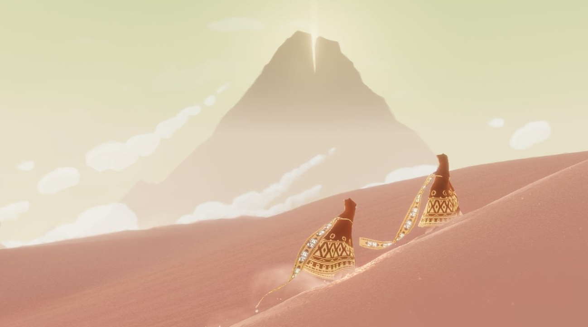

Journey, by thatgamecompany.

---
class: center

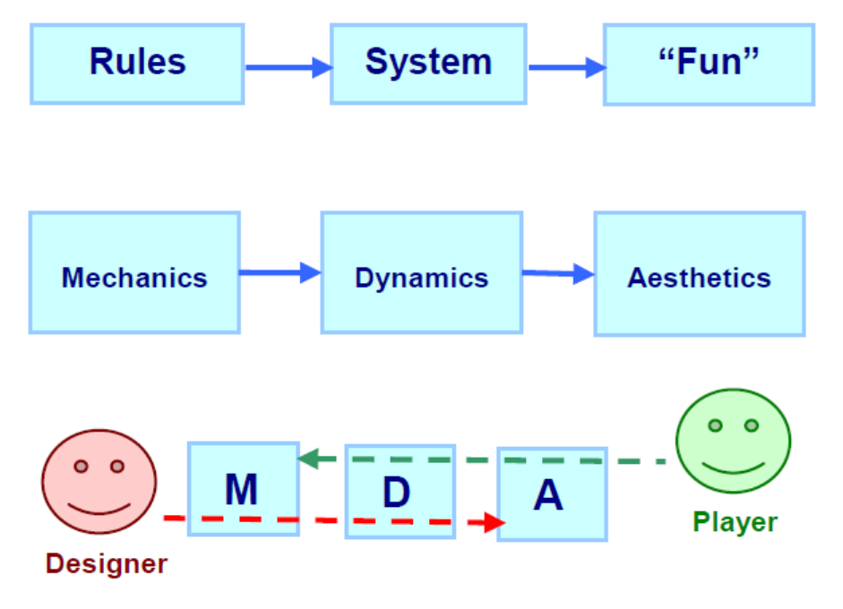

---

### A pragmatic framework

- Focus on integrating the _videogame development process_.
- Providing a structure for _intervention and discussion_.
- This also implies in _separations_ such as the one between game mechanics (actions, verbs) and game content (levels, assets).

---
class: middle

### _Basic_ game design tools

--
1. Constraints;

--
2. Direct & indirect action;

--
3. Goals;

--
4. Challenge;

--
5. Skill, strategy, chance, uncertainty;

--
6. Decision-making & feedback;

--
7. Abstraction;

--
8. Theme;

--
9. Storytelling;

--
10. Context of play;

---

## Main impacts of tools

- They can be thought of as lenses to manipulate relationships between game design elements.
- Foundational principles to be explored.
- They are not focused on being used in isolation, they are more like parameters.
- They provide a repertoire for navigating designs spaces.

---
class: center

### Design spaces

.center[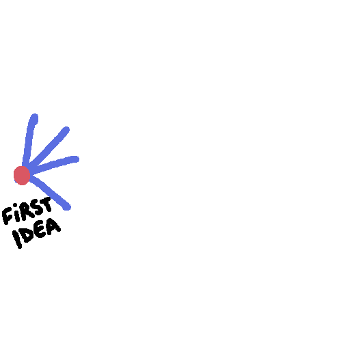]

---

### Design spaces

- All decisions during the process and the options that they open and close.
- Moving back and forward to explore different directions is key to design processes.

---
class: center

### Flow

.no_border[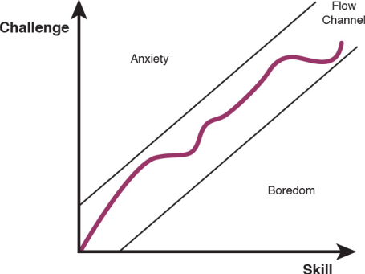]

---
class: middle

# Analysis time!

---

### Cities: Skylines

.cols[

.fifty[
1. Constraints
2. Direct & indirect action
3. Goals
4. Challenge
5. Skill, strategy, chance, uncertainty
6. Decision-making & feedback
7. Abstraction
8. Theme
9. Storytelling
10. Context of play
]

.fifty[
    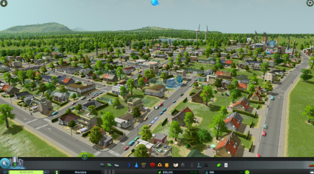
]
]

---

### Cities: Skylines

.cols[

.fifty[
1. Constraints
2. .hi[Direct & indirect action]
3. Goals
4. Challenge
5. Skill, strategy, chance, uncertainty
6. Decision-making & feedback
7. .hi[Abstraction]
8. .hi[Theme]
9. Storytelling
10. Context of play
]

.fifty[
    
]
]

---

### FTL: Faster Than Light

.cols[

.fifty[
1. Constraints
2. Direct & indirect action
3. Goals
4. Challenge
5. Skill, strategy, chance, uncertainty
6. Decision-making & feedback
7. Abstraction
8. Theme
9. Storytelling
10. Context of play
]

.fifty[
    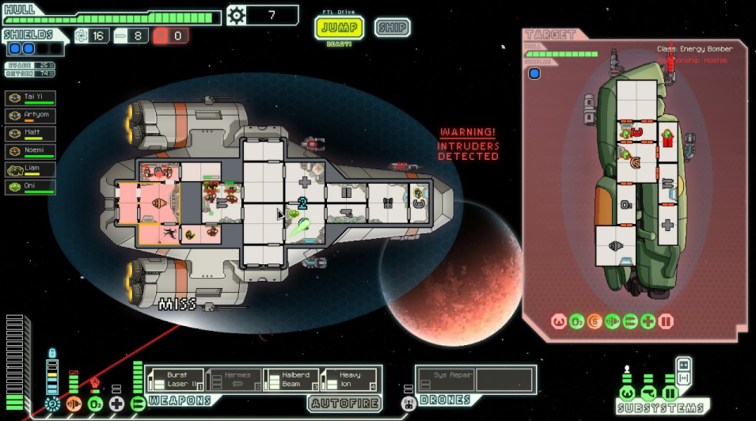
]
]

---

### FTL: Faster Than Light

.cols[

.fifty[
1. Constraints
2. Direct & indirect action
3. Goals
4. Challenge
5. .hi[Skill, strategy, chance, uncertainty]
6. .hi[Decision-making & feedback]
7. Abstraction
8. .hi[Theme]
9. .hi[Storytelling]
10. Context of play
]

.fifty[
    
]
]

---

### Bounden

.cols[

.fifty[
1. Constraints
2. Direct & indirect action
3. Goals
4. Challenge
5. Skill, strategy, chance, uncertainty
6. Decision-making & feedback
7. Abstraction
8. Theme
9. Storytelling
10. Context of play
]

.fifty[
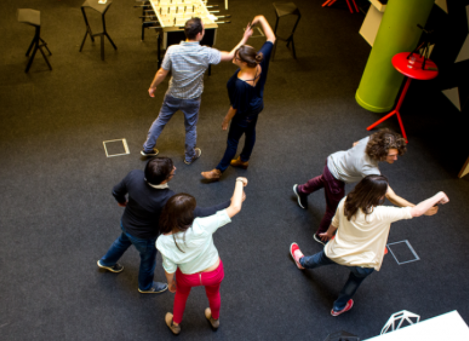
]
]

---

### Bounden

.cols[

.fifty[
1. .hi[Constraints]
2. Direct & indirect action
3. Goals
4. Challenge
5. Skill, strategy, chance, uncertainty
6. Decision-making & feedback
7. Abstraction
8. .hi[Theme]
9. Storytelling
10. .hi[Context of play]
]

.fifty[

]
]

---

### Zelda: Breath of the Wild

.cols[

.fifty[
1. Constraints
2. Direct & indirect action
3. Goals
4. Challenge
5. Skill, strategy, chance, uncertainty
6. Decision-making & feedback
7. Abstraction
8. Theme
9. Storytelling
10. Context of play
]

.fifty[
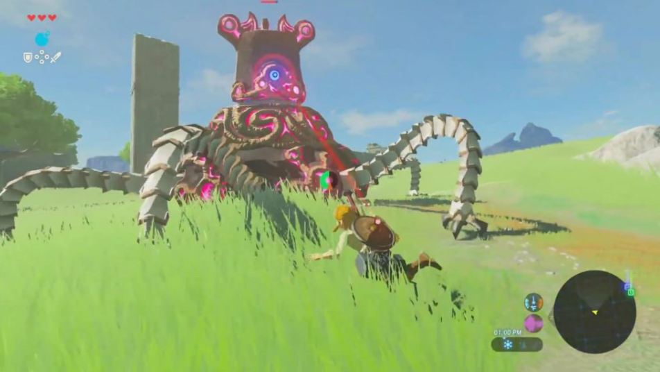
]
]

---

### Zelda: Breath of the Wild

.cols[

.fifty[
1. Constraints
2. Direct & indirect action
3. Goals
4. .hi[Challenge]
5. .hi[Skill, strategy, chance, uncertainty]
6. .hi[Decision-making & feedback]
7. Abstraction
8. Theme
9. .hi[Storytelling]
10. Context of play
]

.fifty[

]
]

---

### Minecraft

.cols[

.fifty[
1. Constraints
2. Direct & indirect action
3. Goals
4. Challenge
5. Skill, strategy, chance, uncertainty
6. Decision-making & feedback
7. Abstraction
8. Theme
9. Storytelling
10. Context of play
]

.fifty[
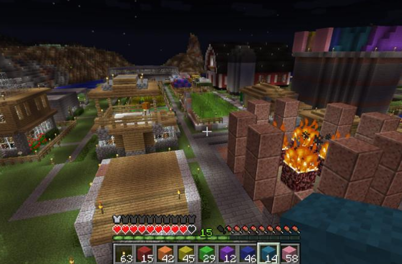
]
]

---

### Minecraft

.cols[

.fifty[
1. .hi[Constraints]
2. Direct & indirect action
3. Goals
4. Challenge
5. Skill, strategy, chance, uncertainty
6. Decision-making & feedback
7. .hi[Abstraction]
8. Theme
9. Storytelling
10. Context of play
]

.fifty[

]
]

---
class: middle center

.no_border[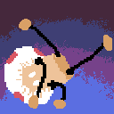]

---
class: middle

## Project 1: .hi[Physical Game Project]

---

### Brief

Groups will create a physical game that is based on and makes use of **everyday objects**. Each group will choose two of the game design tools (except "contexts of play") presented in class to be their main design focus. The following requirements also apply:

1. The game needs to be playable by players sitting around a table;
2. An average play session must last between 10 to 30 minutes;
3. Objects used in the game must be portable and safe to handle;

---
class: middle center

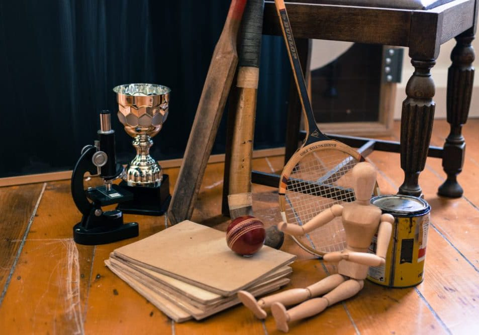

---
class: middle center

## Ideation strategies

---
class: middle center

## .hi[Classic] Brainstorming

---
class: middle center

## .hi[Silent] Brainstorming

---
class: middle

## .hi[Wrap-up!]

- Remember the readings for next week
  - Note: the BrathWaite and Schreiber exercise sections can be skipped
- Bring materials to work on a first prototype of your game next week

---
## References

Anthropy, Anna, and Naomi Clark. 2014. A Game Design Vocabulary: Exploring the Foundational Principles Behind Good Game Design, 1 edition. Upper Saddle River, NJ: Addison-Wesley Professional.

Brathwaite, Brenda, and Ian Schreiber. 2009. Challenges for Game Designers. Boston, MA: Course Technology/Cengage Learning.

Fullerton, Tracy. 2014. Game Design Workshop: A Playcentric Approach to Creating Innovative Games, Third Edition. Natick: CRC Press.

Hunicke, Robin, Marc LeBlanc, and Robert Zubek. 2004. “MDA: A Formal Approach to Game Design and Game Research.” In Proceedings of the AAAI Workshop on Challenges in Game AI, 4:5.

---
## References (cont.)

Macklin, Colleen, and John Sharp. 2016. Games, Design and Play: A Detailed Approach to Iterative Game Design, First edition. Boston, MA ; San Francisco, CA: Addison-Wesley.

Tekinbaş, Katie Salen, and Eric Zimmerman. 2004. Rules of Play: Game Design Fundamentals. Cambridge, Mass: MIT Press.
