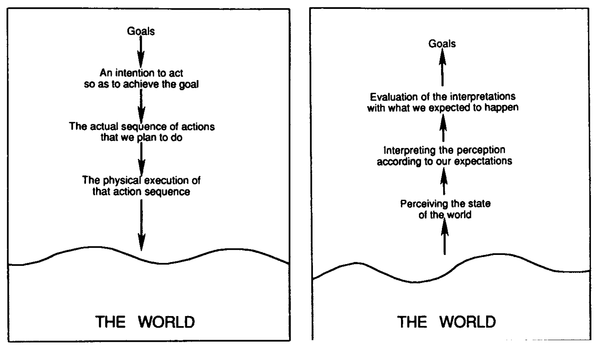
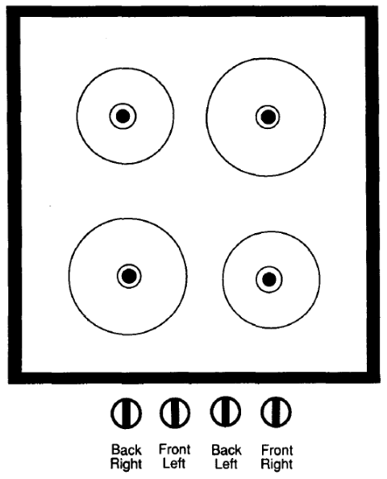
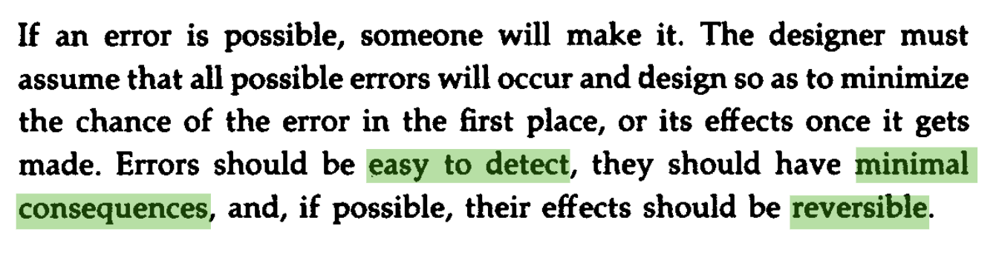
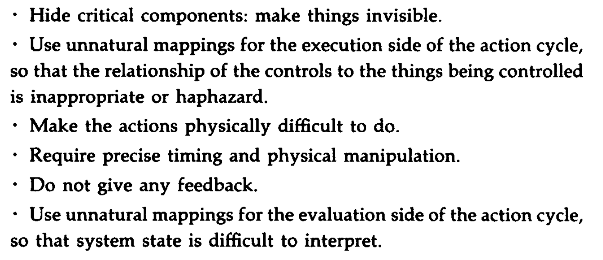
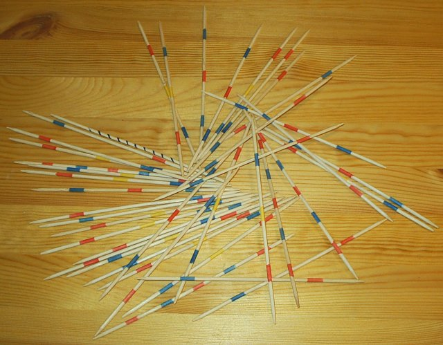

class: middle

# Design in Game Design

.hi[CART 215 / Fall 2019 / Week 04 / Enric Granzotto Llagostera]

---
class: middle

# Chance & Skill

.hi[CART 215 / Fall 2019 / Week 04 / Enric Granzotto Llagostera]

---

class: middle

## Summary

1. Game rec!
2. Lecture: Design in Game Design
3. Exercise: Board Game Deduction
4. _Break_
5. Lecture: Chance & Skill
6. Studio time!

---

### Game rec: .hi[Dicey Dungeons], by Terry Cavanagh

<iframe width="640" height="360" src="https://www.youtube.com/embed/E2AdLWsRuHg" frameborder="0" allow="accelerometer; autoplay; encrypted-media; gyroscope; picture-in-picture" allowfullscreen></iframe>

<https://terrycavanagh.itch.io/dicey-dungeons>

---
class: middle

# Design in Game Design

.hi[CART 215 / Fall 2019 / Week 04 / Enric Granzotto Llagostera]

---

### On difficult games

In groups, think of 2 games that you found in the following criteria:

- Difficult to **learn**

--
- Difficult to **play**

--
- Difficult to **watch**

Try to pin down the reasons for your choices.

---
class: middle

## Norman’s user-centered design

---

### Seven stages of action

---

### Mapping

---

### Affordances

> “(...) affordance refers to the perceived and actual properties of the thing, primarily those fundamental properties that determine just how the thing could possibly be used.” (Norman)

--

- Overlap between perceived and actual is key.
- "just how the thing could possibly be used": how does this connect to play?

---

### Constraints

---

### Some principles for user-centered design

- Use **knowledge in the head** and **in the world**.

--
- **Simplify** task structures.

--
- **Design visibility**: actions should be visible, interpretable, match intentions, with obvious outcomes.

--
- **Mappings**: provide a good **connection** between intentions and possible actions, effects on the system, perceived state and user expectations.

--
- **Leverage constraints**, physical and cultural.

--

Let's think of .hi[examples].

---

### On making errors

.no_border[]

---

### Making things difficult .hi[on purpose]

.no_border[]

---
class: middle

# Chance & Skill

.hi[CART 215 / Fall 2019 / Week 04 / Enric Granzotto Llagostera]

---

## Roles of chance

1. Delaying / preventing solvability

--
2. Disconnect outcomes from skill

--
3. Increase variety and drama

--
4. Enhance decision-making through uncertainty

---

## Implementations of chance

- **Dice**: independence and composability
- **Cards**: versatility (resource and mechanism), connected probability
- **RNG** (random number generators)
- **Hidden information**: random from the player's perspective (really?)

--
- **Measured randomness**: probability as an _object_ for play, uncertainty as design tool

---

## Strategic skill

- Importance of learning and mastery for the draw of strategic play
- What decisions? How often? With what weight?
- Difference between strategy and tactics

---

### On decisions

**Obvious decisions**: no reason to take the non-optimal route. 
--
They might not depend / imply strategy, but might be interesting for players for other (maybe experiential) reasons.

--

**Meaningless decisions**: they just don't change anything. However, _player perception_ is key.

--

**Blind decision**: there is not enough information to make an interesting decision. 
--
Consider how decisions are chained together, though.

---

### Scarcity-based decisions

**Tradeoffs**: exclusive choices due to different forms of scarcity or zero-sum dynamics.

**Dilemmas**: similar to tradeoffs, but imply that all options carry negative effects.

**Risk vs rewards**: exclusive choices involving uncertain (negative / positive) effects.

---

### Strategic-skill design heuristics

1. Do players care when other players are taking their turn?
2. Are players making long-term plans?
3. Are there multiple strategies for multiple games?
4. Are there any obvious, meaningless or blind decisions in the game?

---
class: middle center

---

## "Twitch" skill

Focus on **physical / cognitive scarcity and precision**: dexterity, quick reflexes, reaction speed.

--

**Distinction with strategy** can rely on brain / body division or in a framing of related to the perception / interpretation / execution cycle.

--

Importance of **tuning**: _difficulty levels, dynamic difficulty adjustment, difficulty curves and playtesting_ as tools for this. 

--
Another option is _open-ended customization options_. Consider the effort of negotiating consent and interest in play.

---

### Mechanics of "twitch" skill

- Pure speed
- Timing
- Precision
- Avoidance
- Time pressure

--

Think in **spatial terms** more broadly.

--

Consider how **scarcity** can be mapped to the physical / cognitive aspects of a game.

---

### The implied non-disabled player

The chapter does not discuss how the concept of "twitch" skills does not address issues of accessibility and challenge and disabled players. 

--

In different ways, dominant game design convention and practice serve as _disabling infrastructures_ or _barriers for access_. This is an important issue when considering our role as designers.

--

We will dedicate a full lecture / discussion on this topic in class on a later session. Meanwhile, if you are interested in reading on accessibility and challenge in game design, I can recommend the sources below:

- <http://gameaccessibilityguidelines.com/>
- <https://accessible.games/accessible-player-experiences/>

---
class: middle

## .hi[Wrap-up!]

- Prepare readings.
- Project 1: have a more refined and playable version to test with other groups.

---
## References

Brathwaite, Brenda, and Ian Schreiber. 2009. Challenges for Game Designers. Boston, MA: Course Technology/Cengage Learning.

Norman, D. A. (1990). The Psychology of Everyday Actions. In The design of everyday things (1st Doubleday/Currency ed, pp. 34–53). New York: Doubleday.
