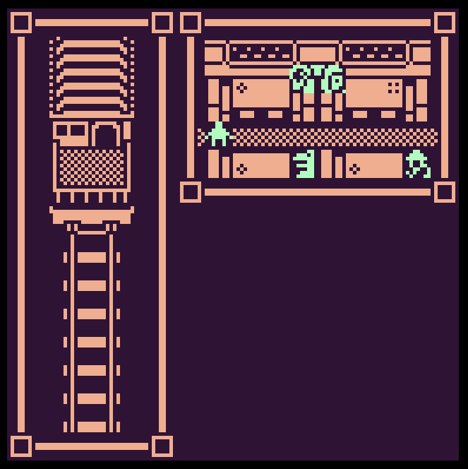
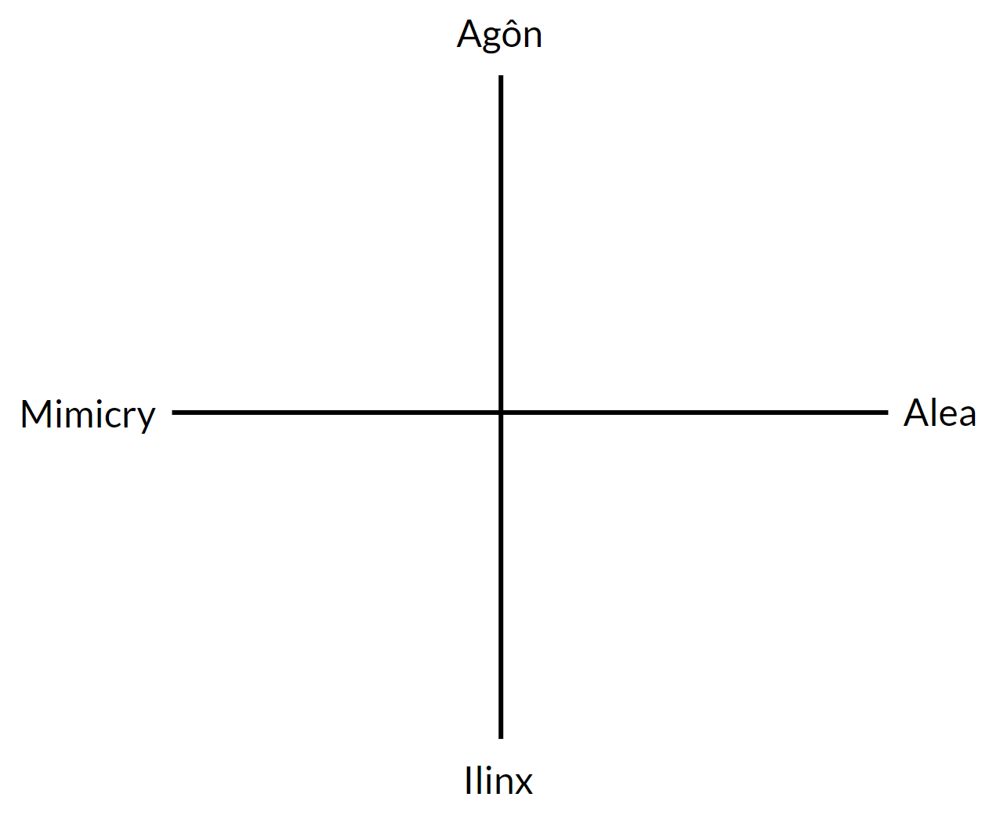

class: middle

# Definition & categories of play

.hi[CART 215 / Fall 2019 / Week 05 / Enric Granzotto Llagostera]

---

class: middle

## Summary

1. Game rec!
2. Lecture: Defining play
3. Lecture: Categorizing play
4. Break
5. Studio time (1h30)
6. On _Project 2_

---

### Game rec: .hi[no destination], by mark wonnacott

<https://candle.itch.io/no-destination>

---

class: middle

# Defining play

---
class: middle

### Definition of play (Huizinga)

> Summing up the **formal characteristics of play** we might call it a free activity standing quite consciously outside "ordinary" life as being "not serious," but at the same time absorbing the player intensely and utterly. It is an activity connected with no material interest, and no profit can be gained by it. It proceeds within its own proper boundaries of time and space according to fixed rules and in an orderly manner. It promotes the formation of social groupings which tend to surround themselves with secrecy and to stress their difference from the common world by disguise or other means. 

> _(Huizinga, in Homo Ludens)_

---

### Definition of play (Caillois)

1. Free
2. Separate
3. Uncertain
4. Unproductive
5. Governed by rules
6. Make-believe

_(Caillois, in Man, play and games)_

---

## Free

- Voluntary act
- Connection to DeKoven’s well-played game

--

> **(1) Free**; (2) Separate; (3) Uncertain; (4) Unproductive; (5) Governed by rules; (6) Make-believe;

---

## Separate

- Extraordinary
- “Restricted, closed, protected universe” (p. 7)
- Located within specific places and durations

--

> (1) Free; **(2) Separate**; (3) Uncertain; (4) Unproductive; (5) Governed by rules; (6) Make-believe;

---

## Uncertain

- Doubt about outcomes
- Tension and conflict do not depend on skill
- “The game consists of the need to find or continue at once a response which is free within the limits set by the rules” (p. 8)
- This maps very strongly with the idea of spaces of possibility

--

> (1) Free; (2) Separate; **(3) Uncertain**; (4) Unproductive; (5) Governed by rules; (6) Make-believe;

---

## Unproductive

- Exchange of property might happen, but not creation of goods, limited only to the players
- “Play is an occasion of pure waste: waste of time, of energy, ingenuity, skill, and often of money (...)”  (p.5)

--
- .hi[Really?]

--

> (1) Free; (2) Separate; (3) Uncertain; **(4) Unproductive**; (5) Governed by rules; (6) Make-believe;

---

## Governed by rules / Make-believe

- “Rules themselves create fictions” (p.8)
- Lack of a referent as a basis for reality in play
- .hi[As if] as a key mechanism for make-believe and metaphor

--

> (1) Free; (2) Separate; (3) Uncertain; (4) Unproductive; **(5) Governed by rules; (6) Make-believe**;

---
class: middle

# .hi[Categorizing] play

---

### Overview

- An abstract, attitude and experience-focused classification under four rubrics:  _Agôn_ (competition), _Alea_ (chance), _Mimicry_, and _Ilinx_ (vertigo).
- Within these categories, games are further classified into a continuum between _paidia_ (free improvisation and uncontrolled fantasy) and _ludus_ (formalized and structured).

---
class: middle center

---
class: middle

1. Overwatch
2. Who took the apple?
3. Dancing
4. Animal Crossing
5. Petanque
6. Virtual reality
7. The Sims
8.  Minecraft
9.  Vesper.5
10. Dungeons & Dragons

---
class: middle

## .hi[Wrap-up!]

- Prepare readings, as usual.
- **Project 2 (card / board game)**: Create different groups (4 students per group), write and bring a collective statement on what .hi[categories / types of play] are you interested in exploring in a board / card game.

---
## References

Caillois, Roger. 1961a. “The Classification of Games.” In Man, Play, and Games, 11–36. New York: Free Press of Glencoe.

Caillois, Roger. 1961b. “The Definition of Play.” In Man, Play, and Games, 3–10. New York: Free Press of Glencoe.
