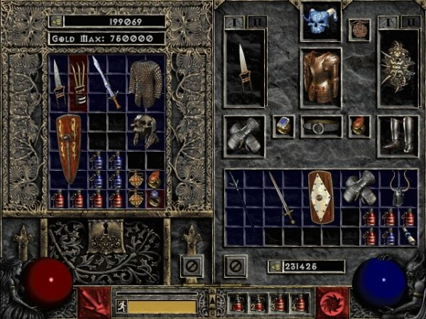
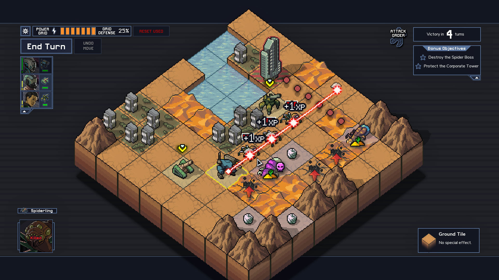
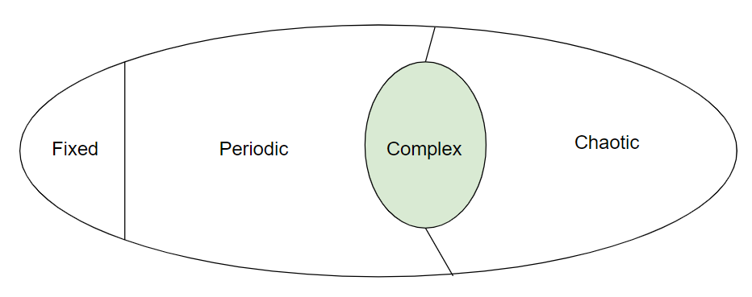
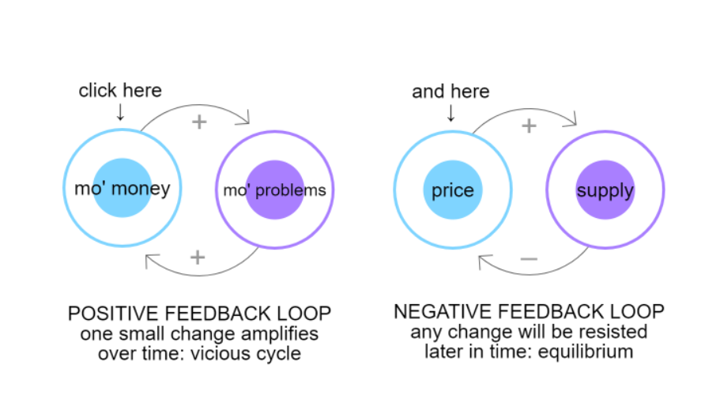
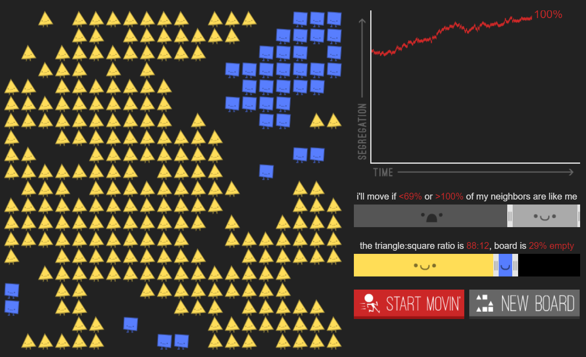

class: middle

# Systems, complexity and simulations

.hi[CART 215 / Fall 2019 / Week 06 / Enric Granzotto Llagostera]

---

class: middle

## Summary

1. Lecture: Systems, complexity and simulations (1h)
2. Studio time [Project 1] (30m)
3. Break (30min)
4. Playtesting session (1h30)
5. Studio time [Project 2] (30m)

---
class: middle

# Systems & Complexity

---

### What?

> A set of parts that interrelate to form an integrated whole.

All systems share:

1. Objects
2. Attributes
3. Internal relationships
4. Environment

A system can be _closed_ or _open_, in relation of its exchanges with its environment.

---
background-image: url(../images/chess.png)
class: invert

---
class: invert center

---
class: invert center

---

### Complexity

Complicated and unpredictable, but not so much that relationships are too dynamic and random.

Meaningful play depends of a certain measure of complexity in at least **one** systemic aspect of the game (Salen and Zimmerman). 

Meaningful play emerges of the interplay between player action and system outcome.

--

.hi[Remember direct and indirect action?]

---
class: middle center

---

### Complexity and emergence

Complexity of gameplay has a non-linear relationship with number of rules. It depends on how coupled & context-dependent the interactions in a system are.

Critical qualities for dynamic behaviors (Dormans, 2012, p.49-52):

1. Local rules can be easily described in isolation.
2. The system must allow for long-range (interpart) communication.
3. Parts must be active (changing state).

---

### Conway’s Game of Life

- Any live cell with fewer than two live neighbors dies, as if by underpopulation.
- Any live cell with two or three live neighbors lives on to the next generation.
- Any live cell with more than three live neighbors dies, as if by overpopulation.
- Any dead cell with exactly three live neighbors becomes a live cell, as if by reproduction.

<http://pmav.eu/stuff/javascript-game-of-life-v3.1.1/>

---
background-image: url(../images/life.gif)
class: invert

---

### Game design and engine tuning

A space of possibility complex enough to allow for **emergence** adds replayability and renewed experiences. Main difference between games of emergence and progression (Juul; Dormans).

These can happen at many **different scales**: smaller gameplay decisions, larger session-length strategies or even meta-game dynamics (rankings, patches, expansions).

Toy-like play as basis for experimenting with objects, attributes and how player actions affect them.

---

### Feedback loops

“A feedback loop is created when the effects of a change in one part of the system come back and affect the same part at a later moment in time.”  (Dormans, 2012)

- **Positive feedback loops** as system destabilizers, increasing difference, reinforcing effects.
- **Negative feedback loops** as system estabilizers, diminishing difference, diminishing effects.

---
class: center

<https://ncase.me/loopy/v1.1/>

---
class: middle

# Simulations

---

### What is a simulation?

A **simulation** is a procedural representation of aspects of “reality” (Salen & Zimmerman, p.423).

They incorporate behaviour into their representation, beyond sequences of events.

There are many types of simulation which are not used as games.

Simulations act _metaphorically_.

---
class: center

<https://ncase.me/polygons/>

---

### Simulation and games

> “Seen as simulations, games are dynamic systems that construct representation through play” (Salen & Zimmerman, p.427).

Games as simulations of conflict, characters, “realities”: not a focus on a notion of empirical truth, but as a context for engaging play.

Connection to _paidia_ and _make-believe_.

---

### Design of simulations

Simulations are .hi[abstractions], purposeful reductions. They are also limited and systemic.

--
- What to simulate? How?

--
- What values are embedded in these choices?

--
- What will be the scope of the details in the simulation?

--
- How to approach it: as a case-based exercise or a general case design strategy?

---

### References

Adams, E., & Dormans, J. (2012). Game Mechanics: Advanced Game Design (1 edition). Berkeley, CA: New Riders.

Frasca, G. (2003). Simulation vs Narrative : Introduction to Ludology. In B. Perron & M. J. P. Wolf (Eds.), The video game theory reader (pp. 221–236). New York ; London: Routledge.

Tekinbaş, K. S., & Zimmerman, E. (2004). Rules of play: game design fundamentals. Cambridge, Mass: MIT Press.
